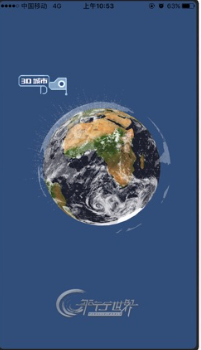

“平行世界”平台，是一个将现实世界中的街道等有价值的构件高度还原在虚拟世界中，实现购物、旅游、社交、教育、医疗、娱乐等服务在实体与网络之间的无缝对接，建立线上实景体验，线上线下消费完美融合的全行业O2O超级平台。同时，其平台创新植入情景化社交以及真实场景游戏等元素，未来还将开发其应用场景集合接口，让所有企业和个人都可依托平台进行商业开发，真正实现大众创业、万众创新。成都景和千城致力于将平行世界打造成一个完整互通的、持续发展的互联网全业态的创新生态体系。目前，围绕其核心平台已开发平行世界—3D城市、平行世界—景区AR、平行世界—三维可视化政府综合管理系统、平行世界—三维可视化消防预案管理系统
