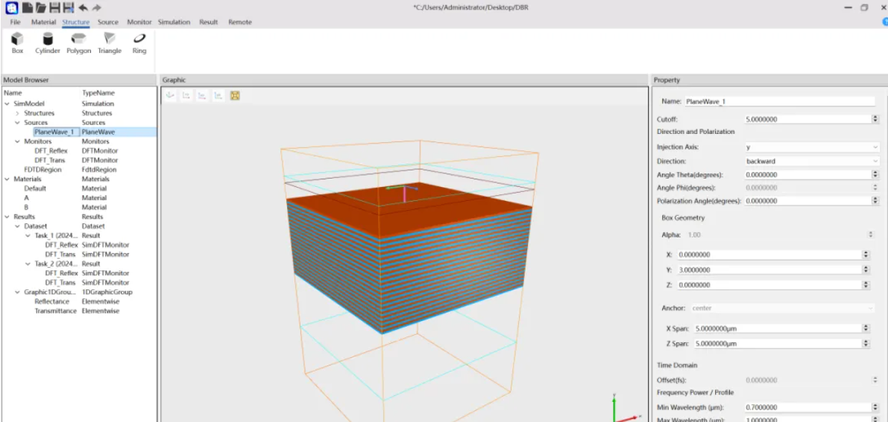
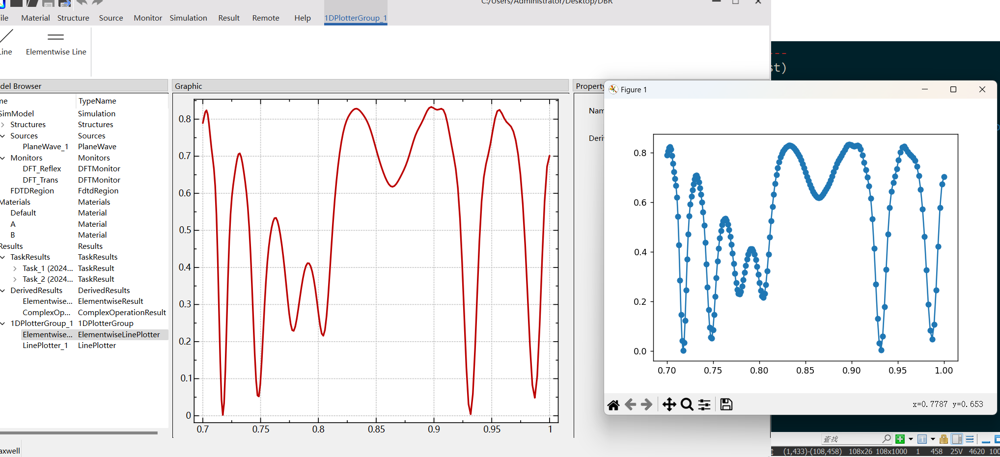
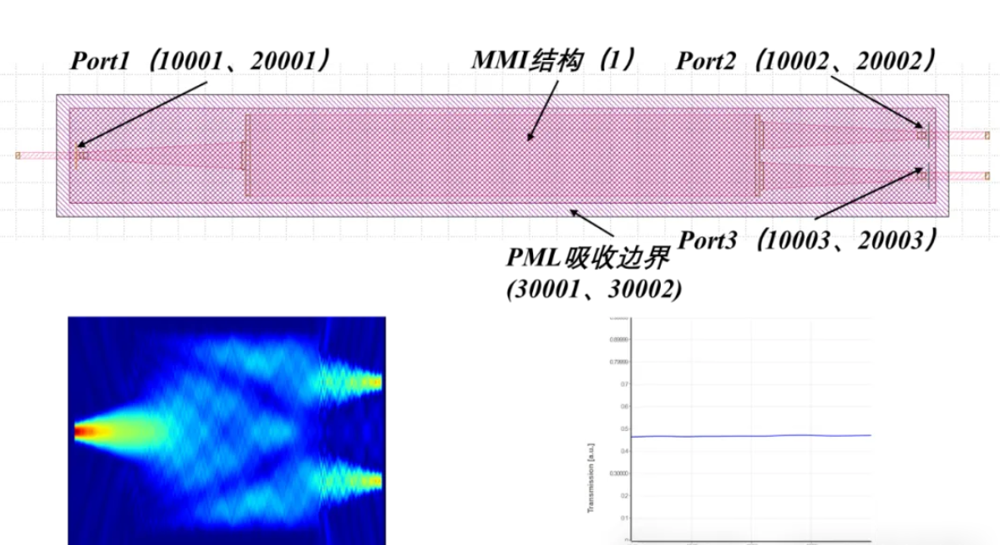

FDTD 是一款面向光子器件设计与仿真的软件平台，适用于波导、光栅、超表面、纳米光子器件等结构的建模、分析和优化。平台支持二维、三维仿真，提供多种光源、材料属性、边界条件以及功率通量、远场模式、Poynting 矢量等分析工具，并可通过 Python 脚本和参数扫描完成自动化设计优化。其优势在于灵活的几何建模、较高的仿真精度、友好的操作界面，可帮助研究人员和工程师更高效地完成复杂光子器件的设计流程。

